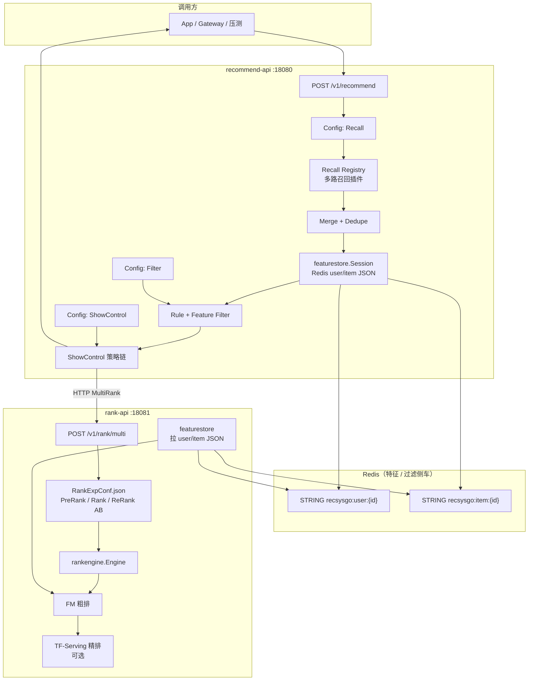
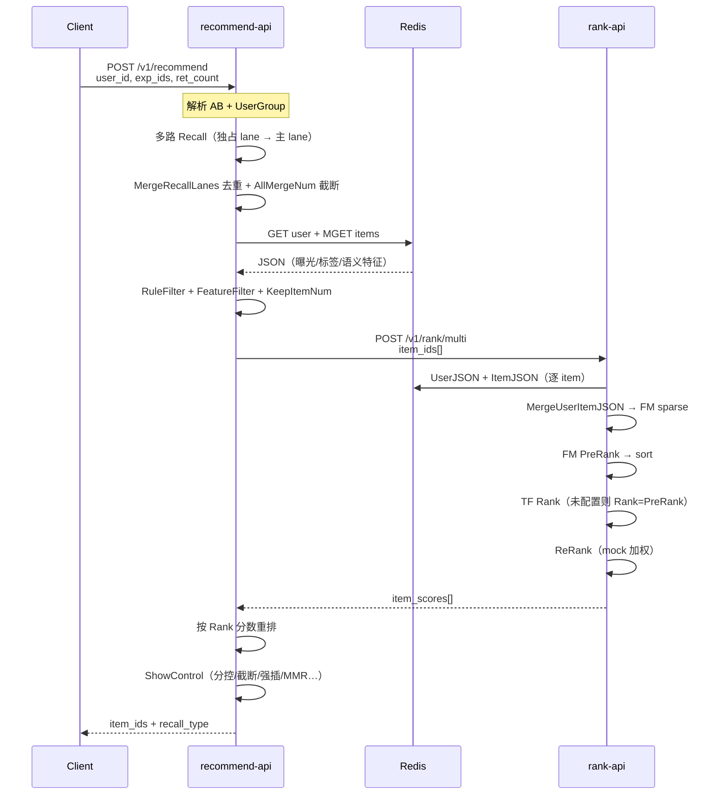
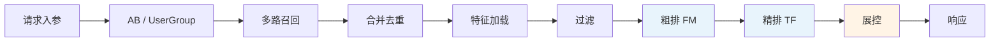
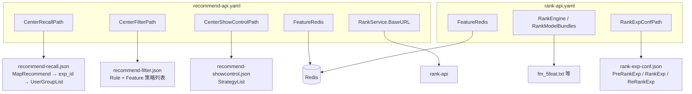
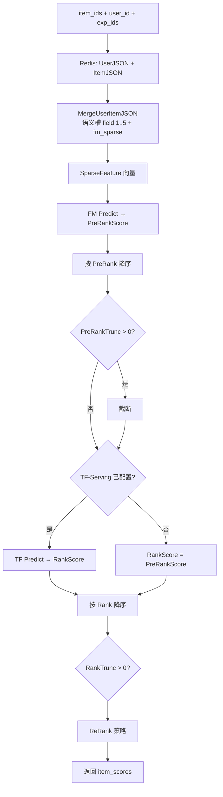

# recsys_go

面向**通用推荐链路**的 Go 参考实现：多路召回 → 合并去重 → 规则/特征过滤 → 粗排（FM）→ 精排（TF-Serving 可选）→ 展控 → 返回结果。  
不绑定具体业务域（地图/直播等），配置形态对齐常见 **Center + Rank** 双服务拆分，便于对照自有业务推荐中台做迁移或实验。

仓库地址：[https://github.com/gerogexiongle/recsys_go](https://github.com/gerogexiongle/recsys_go)

---

## 1. 系统架构



| 服务 | 端口 | 职责 |
|------|------|------|
| **recommend-api** | 18080 | 召回、合并、过滤、调用排序、展控 |
| **rank-api** | 18081 | 粗排 / 精排 / 重排，读特征并打分 |

共享库 **`pkg/recsyskit`**（领域无关 item/user/流水线抽象）、**`pkg/featurestore`**（Redis JSON 特征与 FM 语义槽合并）。

---

## 2. 端到端数据流（一次推荐请求）



---

## 3. 推荐链路分阶段说明



| 阶段 | 执行位置 | 配置来源 | 说明 |
|------|----------|----------|------|
| **多路召回** | recommend | `recommend-recall.json` | `ExclusiveRecallList` 优先，再 `RecallAndMergeList`；每路 `RecallNum` / `MergeMaxNum` / `SampleFold` / `UseTopKIndex` |
| **合并** | `pkg/recsyskit` | `AllMergeNum` | 按 item_id 去重；独占路先入队 |
| **特征加载** | `pkg/featurestore` | `FeatureRedis` | 一次 `Session`：user GET + items MGET，供过滤与（rank 侧再次拉取）FM |
| **规则过滤** | `centerconfig` | `recommend-filter.json` → `RuleFilterStrategyList` | 如曝光上限 `LiveExposure` |
| **特征过滤** | `centerconfig` | `FeatureFilterStrategyList` | 如 `FeatureLess`、`LabelTypeWhiteList` |
| **池子截断** | `centerconfig` | `KeepItemNum` | 进入排序前的候选上限 |
| **粗排 PreRank** | rank | `RankExpConf` + FM 模型文件 | FM 对 sparse 特征打分并截断 |
| **精排 Rank** | rank | `RankExpConf` + `RankModelBundles` | TF-Serving HTTP；未配置时 **Rank 分 = PreRank 分**（实验环境） |
| **重排 ReRank** | rank | `ReRankExp`（可选） | 当前为 mock 微调，可替换为业务重排 |
| **展控** | recommend | `recommend-showcontrol.json` | `ScoreControl` / `HomogenContent` / `ForcedInsert` / `MMRRearrange` 等 |

排序相关 AB、截断、模型名**仅在 rank 服务**配置，recommend 只负责召回池与展控，避免重复截断。

---

## 4. 配置架构（与业务解耦的三文件）



兼容模式：单文件 **`recommend-funnel.json`**（`FunnelConfigPath`）将召回/过滤/展控写在同一 JSON；若配置了 `CenterRecallPath`，则**优先使用三文件模式**。

---

## 5. Rank 内部打分流水线



**特征语义（实验/demo）**：用户 `age` / `gender` / `income_wan`，物品 `ctr_7d` / `revenue_7d` → 映射为 FM 五槽位；亦支持 `fm_sparse` / `tf_dense` 原始字段。详见 `pkg/featurestore/merge.go`。

---

## 6. Redis Key 约定（开源默认）

| 用途 | Key 模式 | 值格式 |
|------|----------|--------|
| 用户特征 + 过滤侧车 | `recsysgo:user:%d` | JSON：`age`, `gender`, `exposure`, … |
| 物品特征 + 过滤侧车 | `recsysgo:item:%d` | JSON：`ctr_7d`, `feature_less`, `label`, … |

生产环境常见为 **HASH 分桶**（多 field）；本仓库用 **STRING 整包 JSON** 降低演示复杂度，接口层 `Fetcher` 可扩展倒排 ZSET、物料集合等（见 `pkg/featurestore/keys.go` 中 `FutureKeyKinds`）。

密码：`FeatureRedis.Crypto=true` 时使用与线上一致的 AES 密文（`pkg/redisdecrypt`），明文密码通过 `EncryptPassword` 生成 hex 写入配置。

---

## 7. 目录结构

```
recsys_go/
├── api/recsys/v1/          # proto 定义（可选生成）
├── pkg/
│   ├── recsyskit/          # 流水线抽象、漏斗配置、合并/过滤工具
│   ├── featurestore/       # Redis 特征、Session、FM JSON 合并
│   ├── featurekit/         # 稀疏特征类型
│   └── redisdecrypt/       # Redis 密码加解密
├── services/
│   ├── recommend/          # Center 侧：召回 → 过滤 → 调 rank → 展控
│   │   ├── etc/            # yaml + recall/filter/show JSON
│   │   └── internal/
│   │       ├── centerconfig/
│   │       ├── recall/     # 召回插件注册表
│   │       └── logic/
│   └── rank/               # Rank 侧：FM + TF + RankExpConf
│       ├── etc/
│       └── internal/rankengine/
└── scripts/
    ├── seed_feature_redis.py
    ├── e2e.sh
    └── e2e_full_chain.sh
```

---

## 8. 快速开始

### 依赖

- Go 1.22+
- Redis（可选；关闭时 `FeatureRedis.Disabled: true`）
- Python 3 + `redis` + `pycryptodome`（仅种子脚本）

### 构建

```bash
git clone https://github.com/gerogexiongle/recsys_go.git
cd recsys_go
make build    # bin/recommend-api, bin/rank-api
```

### 配置

编辑 `services/recommend/etc/recommend-api.yaml` 与 `services/rank/etc/rank-api.yaml` 中的 `FeatureRedis.Host` / `PasswordHex`。

生成 `test123` 的密文：

```bash
go test ./pkg/redisdecrypt/ -run TestEncryptTest123Hex -v
```

### 写入演示数据（2 用户 + 10 物品）

```bash
export RECSYS_SEED_REDIS=1
export RECSYS_REDIS_HOST=127.0.0.1   # 按实际修改
python3 scripts/seed_feature_redis.py
```

### 启动

```bash
./bin/rank-api -f services/rank/etc/rank-api.yaml &
./bin/recommend-api -f services/recommend/etc/recommend-api.yaml &
```

### 调用

```bash
curl -s -X POST http://127.0.0.1:18080/v1/recommend \
  -H 'Content-Type: application/json' \
  -d '{"uuid":"demo","user_id":900001,"exp_ids":[0],"ret_count":5}'
```

### 一键自测

```bash
make e2e          # 轻量 stub 召回 + mock rank
make e2e-full     # Redis + FM pipeline + 三文件 center 全链路
```

---

## 9. HTTP 接口

| 方法 | 路径 | 服务 | 说明 |
|------|------|------|------|
| GET | `/health` | both | 健康检查 |
| GET | `/v1/ready` | recommend | 配置就绪（rank 客户端、center/funnel） |
| POST | `/v1/recommend` | recommend | 完整推荐 |
| POST | `/v1/rank/multi` | rank | 多组候选打分 |

---

## 10. 扩展指南

| 扩展点 | 做法 |
|--------|------|
| 新召回通道 | 在 `services/recommend/internal/recall/registry.go` 增加 `RecallType` 分支，或改为接口+注册表 |
| 新过滤策略 | 在 `centerconfig/apply.go` 增加 `FilterType` 分支 |
| 新展控策略 | 在 `centerconfig/apply.go` 增加 `ShowControlType` 分支 |
| 新模型 / AB | `rank-api.yaml` 的 `RankModelBundles` + `rank-exp-conf.json` |
| 倒排 / 物料 Redis | 实现新 `Fetcher` 接口，独立 key 命名空间，不与 `recsysgo:user/item` 混用 |

---

## 11. 设计原则（开源版）

1. **Center / Rank 分离**：候选扩量与策略在 recommend；算力密集打分在 rank。  
2. **配置驱动**：策略列表用 JSON 描述，按 `exp_id` + `UserGroup` 选桶。  
3. **领域无关命名**：代码中统一使用 `Item` / `User`，不写业务专有名词。  
4. **可测**：单元测试 + `scripts/e2e_full_chain.sh` 覆盖召回→过滤→FM→展控。

---

## License

MIT（如未另行声明，以仓库为准。）
